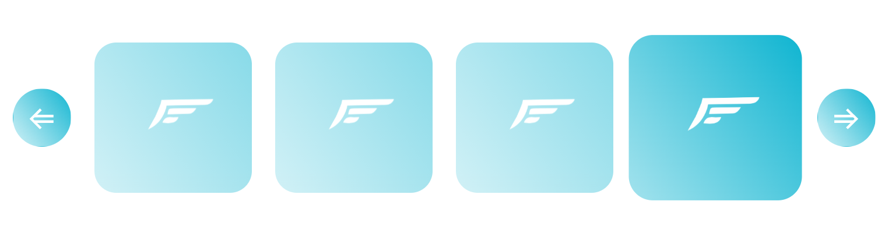

# Challenge Pro Flight

This project was made with `Create React App`, following the specification of the challenge.

## `Other technologies used:`

- Bootstraps.
- React-icons
- Sass.

## `Proyect`

In the project directory, you can run:

`npm install:`

to install the aplication, and then run the proyect
 
 

## `Capture of the finihsed proyect`

<h2 align="center"></h2>
